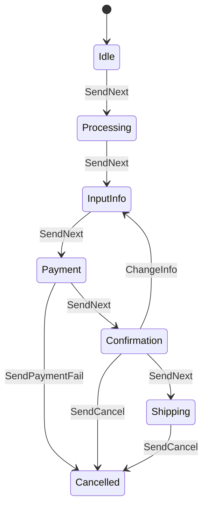

# State Machine & KStateMachine Library

## Overview

**State Machine** is a logical model that describes the behavior of a system through:
- **States** 
- **Transitions** beetween states by event
- **Actions** executed at each state or during transitions

### Component:
| Component        | Describe |
|--------------------|-------|
| **State**          | State at the specific moment |
| **Transition**     | Moving between 2 states, trigger by Event |
| **Event**          | User to moving to other state |
| **Initial State**  | Initial state of system |
| **Final State**    | Final state of system |
| **Nested State**   | A child state within a parent state (hierarchical structure) |

### Note: 
#### TransitionType: 

`TransitionType` defines **how a transition behaves** within a nested or parent-child state relationship.
| Type | Description |
|------|-------------|
| `LOCAL` | The transition **stays within the current hierarchical state**. Entry/exit handlers of parent state are **not called**. |
| `EXTERNAL` | The transition **exits the source state and its parents**, then enters the target state (including entering parent states if needed). Entry/exit handlers **are executed**. |
> 💡 **Use `LOCAL`** if you want a "soft" transition within a composite state, avoiding unnecessary re-entry.  
> **Use `EXTERNAL`** if a full exit-entry cycle is needed.


---

## Library `KStateMachine` (ru.nsk)

### 🔹 What is KStateMachine?

KStateMachine is normal Kotlin library with strenght to build **state machines**:
- Support **nested states**
- Support **asynchronous transitions** : do not block main thread,handle some cases that could be delay or waiting result form API, ...
- Open, testing, visualize logic flow easily: can use lib to export to state diagram, it's easy to observe and maintain

### 🔹 Import

```kotlin
dependencies {
    implementation(libs.nsk90.kstatemachine)
    implementation(libs.kstatemachine.coroutines)
    implementation(libs.kstatemachine.serialization)
}
```

---

## Example for Order



```kotlin
sealed class OrderManagerState : DefaultState() {
        object Idle : OrderManagerState()

        object Processing : OrderManagerState()
        object InputInfo : OrderManagerState()
        object Payment : OrderManagerState()
        object Confirmation : OrderManagerState()

        object Shipping : OrderManagerState()
        object Cancelled : OrderManagerState(), FinalState
    }

    sealed class OrderManagerEvent : Event {
        object SendPaymentFail : OrderManagerEvent()
        object SendCancel : OrderManagerEvent()
        object ChangedInfo : OrderManagerEvent()

        object SendNext : OrderManagerEvent()
    }

fun main(): Unit = runBlocking {
    val orderStateMachine = createStateMachine(this) {
        addInitialState(OrderManagerState.Idle) {
            onEntry {
                println("Idle - entry")
                delay(100)
            }
            onExit { println("Idle - onExit") }
            transition<OrderManagerEvent.SendNext> {
                targetState = OrderManagerState.Processing
            }
        }
        addState(OrderManagerState.Processing) {
            onEntry { println("======== Processing - entry")
                delay(100)
            }
            onExit { println("======== Processing - onExit") }

            addInitialState(OrderManagerState.InputInfo) {
                onEntry { println("InputInfo - entry")
                    delay(100)
                }
                onExit { println("InputInfo - onExit") }
                transition<OrderManagerEvent.SendNext> {
                    type = TransitionType.LOCAL
                    targetState = OrderManagerState.Payment
                }
            }
            addState(OrderManagerState.Payment) {
                onEntry { println("Payment - entry")
                    delay(100)
                }
                onExit { println("Payment - onExit") }
                transition<OrderManagerEvent.SendNext> {
                    targetState = OrderManagerState.Shipping
                }
                transition<OrderManagerEvent.SendPaymentFail> {
                    targetState = OrderManagerState.Cancelled
                }
            }
            addState(OrderManagerState.Confirmation) {
                onEntry { println("Confirmation - entry")
                    delay(100)
                }
                onExit { println("Confirmation - onExit") }
                transition<OrderManagerEvent.SendNext> {
                    targetState = OrderManagerState.Shipping
                }
                transition<OrderManagerEvent.SendPaymentFail> {
                    targetState = OrderManagerState.Cancelled
                }
            }
        }
        addState(OrderManagerState.Shipping) {
            onEntry { println("Shipping - entry")
                delay(100)
            }
            onExit { println("Shipping - onExit") }

        }
        addFinalState(OrderManagerState.Cancelled) {
            onEntry { println("Cancelled - entry")
                delay(100)
            }
            onExit { println("Cancelled - onExit") }
        }
        onFinished { println("Finished") }
    }

    orderStateMachine.processEvent(OrderManagerEvent.SendNext)
    orderStateMachine.processEvent(OrderManagerEvent.SendNext)
    orderStateMachine.processEvent(OrderManagerEvent.SendNext)
    orderStateMachine.processEvent(OrderManagerEvent.SendNext)
    orderStateMachine.processEvent(OrderManagerEvent.SendNext)
    orderStateMachine.processEvent(OrderManagerEvent.SendNext)

}
```

---

## When to use

- Multiple states with clear transition rules
- Complex logic flow that needs to be predictable and maintainable
- Need to separate UI and logic clearly
- Situations involving asynchronous waiting (e.g. API calls)

---

## Advantage

- Management states clearly 
- Open and maintainance easily
- Can avoid wrong logic when transitioning
- The logic and the interface can be separated

---

## 📚 Reference

- [KStateMachine GitHub](https://github.com/nsk90/kstatemachine)
- [Wiki: Finite State Machine](https://en.wikipedia.org/wiki/Finite-state_machine)

---

## Contact

Author: **AnhNN166**  
Role: Developer – Automotive Domain  
