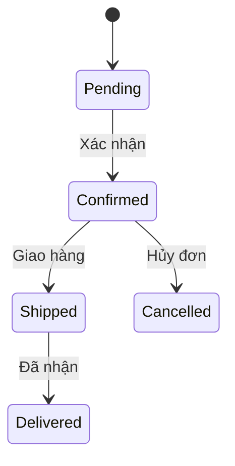

# KStateMachine

# 📘 Giới thiệu về State Machine & KStateMachine Library

## 🧠 State Machine là gì?

**State Machine (Máy Trạng Thái)** là một mô hình logic giúp mô tả hành vi của hệ thống thông qua:
- **Các trạng thái (States)**
- **Chuyển tiếp (Transitions)** giữa các trạng thái dựa trên sự kiện
- **Hành động (Actions)** thực thi tại mỗi trạng thái hoặc khi chuyển tiếp

### 🧱 Thành phần chính:
| Thành phần         | Mô tả |
|--------------------|-------|
| **State**          | Trạng thái hệ thống tại một thời điểm |
| **Transition**     | Kết nối giữa 2 trạng thái, được kích hoạt bởi sự kiện |
| **Event**          | Điều kiện/kích hoạt để chuyển trạng thái |
| **Initial State**  | Trạng thái bắt đầu |
| **Final State**    | Trạng thái kết thúc |
| **Nested State**   | Trạng thái con nằm trong trạng thái cha (tổ chức phân cấp) |

---

## 📦 Thư viện `KStateMachine` (ru.nsk)

### 🔹 KStateMachine là gì?

KStateMachine là thư viện Kotlin đơn giản nhưng mạnh mẽ để xây dựng **finite state machines**:
- Hỗ trợ **nested states**
- Hỗ trợ **asynchronous transitions**
- Dễ mở rộng, dễ test, dễ visualize luồng xử lý

### 🔹 Cài đặt

```kotlin
dependencies {
    implementation("ru.nsk:kstatemachine:0.24.0")
}
```

---

## 🚚 Ví dụ: Đơn hàng



---

## 🔧 Khi nào nên dùng?

- Khi luồng logic có nhiều trạng thái, điều kiện rẽ nhánh
- Khi cần mô hình hóa các hành vi phức tạp
- Khi cần đảm bảo trạng thái hợp lệ, dễ debug, dễ test

---

## ✅ Ưu điểm

- Quản lý trạng thái rõ ràng
- Dễ mở rộng và bảo trì
- Tránh lỗi logic khi chuyển trạng thái
- Có thể tách biệt phần logic & giao diện

---

## 📚 Tài liệu tham khảo

- [KStateMachine GitHub](https://github.com/nsk90/kstatemachine)
- [Wiki: Finite State Machine](https://en.wikipedia.org/wiki/Finite-state_machine)

---

## 📞 Liên hệ

Author: **AnhNN166**  
Role: Developer – Automotive Domain  
